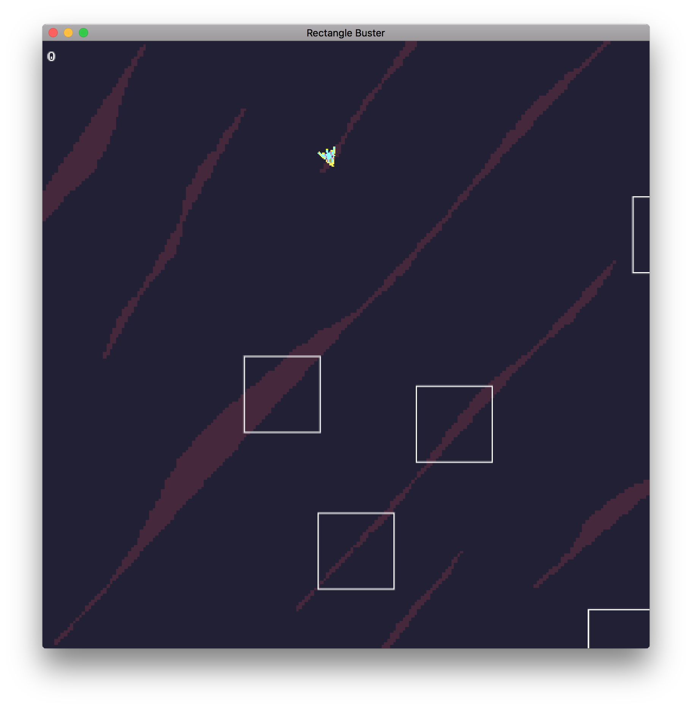

  
  

Rectangle Buster is a little side project I worked on at the start of my Spring semester of 2018. I hadn't done any programming in the past year leading to that point, so I thought working on a video game would be a good warm up to a semester that would be filled with projects. The game is simple. The player controls a little spacecraft and the goal of the game is to destroy as many rectangles, which are stand-ins for asteroids, before they eventually blow up by colliding into them. When the player loses, they are treated to a high-score screen, and a prompt to start the game all over again. The controls are simple, up arrow to accelerate the ship forwards to whichever direction it's pointing towards, down arrow accelerates the ship backwards, left and right arrows turn the ship left or right respectively, and the spacebar fires lasers towards the direction the ship is facing. 

The game was made using the LOVE 2D + Lua framework, which is a fine and dandy framework for making 2D games. There are a good amount of learning material for the framework, and Lua, though it has it's own little weird quirks, was an easy language to get into, so I found myself making steady progress as weeks passed. While going through the material, I wanted to make sure that I really understood what was being taught by implementing those ideas into Rectangle Buster. While the game itself is an Asteroids clone, I wanted to immerse myself into game design and problem solving by making the game with the idea of Asteroids in mind without copying or checking available solutions. I wanted to make sure that I could come up with an implementation of Asteroids on my own, and the experience felt worthwhile and fun. 

While working on the project, I felt like I learned a lot on project management, how to devote time and resources efficiently on a solo level, how to structure files, and game design. While implementing game design and game structure ideas I had learned, the game went from being bare-bones and simple, to something more fleshed out and complete. Okay, it's not finished or really polished, nor is it entirely original, it's a clone after all, but it's a marker of the progress I have made while learning more about game development or just solo-project management in general. 

