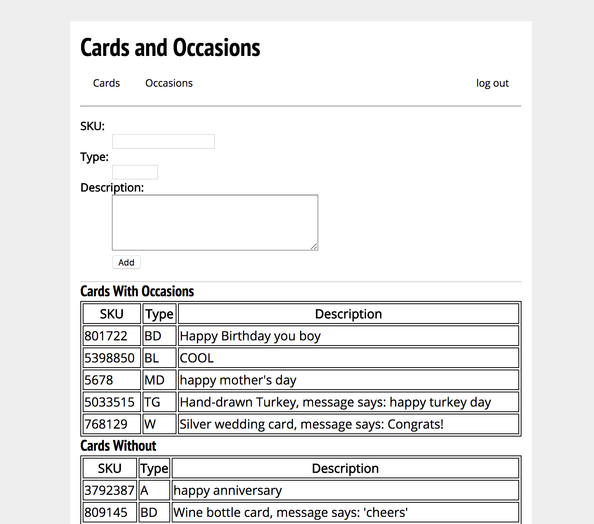
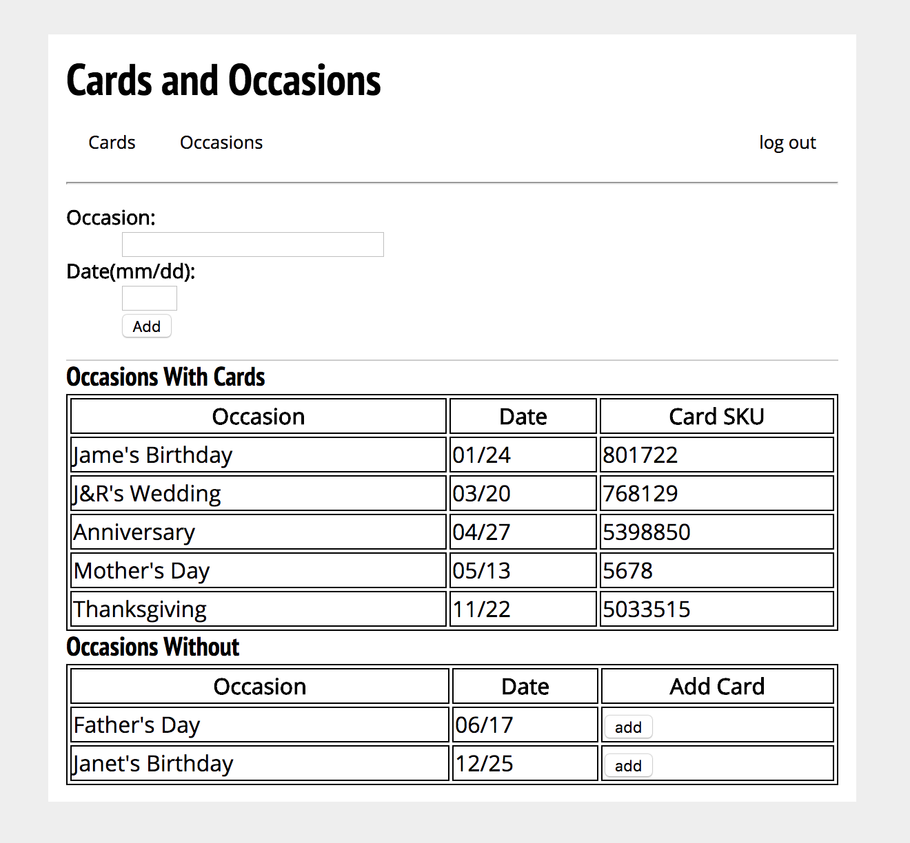
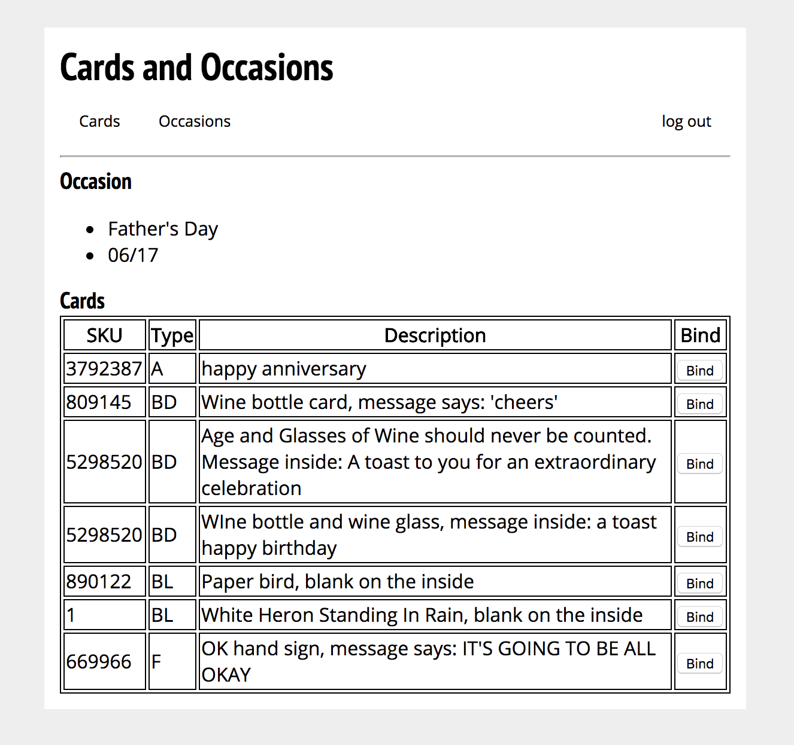

  
  
  
  

This is my project submission for my Database Management class, Cards and Occasions. At the time of conceiving the project idea, I was working a job in a greeting cards store. We would get customers who would buy a good chunk of cards in a single transaction and say, "That's all the card shopping I'll have to do all year," and I would wonder, how would they keep track of all of those cards? Sometimes when buying a card, they would not have an express purpose for it, just that when the time comes, they would use it. When buying multiple cards, they start to pile up, and over time, I assume people will forget about the cards that they have stashed away that they could use for an upcoming occasion, like Mother's Day, or their best friend's wedding. Cards and Occasions is something I thought up to combat this specific issue. 

Cards and Occasions works like this, when a person buys any number of cards, they will be added to their accounts card database which they can check at any point. Each card will have a description and image of it, as well as the cards type, to help customers know what card they have and what it looks like without having to go through all their physical cards to find it just to look at it. Users will also have a occasions page that has a bunch of occasions the host thinks is important, like Mother's Day, as well as user-added occasions, such as a best friend's wedding. When an occasion draws near, the user will be notified, and he or she can pick from their own pool of cards whichever card they feel is appropriate for the event. This makes it easier for people to go through their physical collection, as they pick the card they want to use beforehand, rather than going through the physical collection first.

My implementation uses Flask with Python, which were both nice to use, and an Oracle DBMS. At the current state, it's pretty barebones, but it does what I set it out to do. It adds cards and occasions to a database, and it can bind two card and occasion tuples together using a relationship table. My main concern was to get a presentable product out in time for the project presentation. The add functions require the users to add all the information in themselves, which might be too much, but getting cards to bind to occasions was my primary concern. In the future, I could make it easier to add cards for users, as my goal was to have it done automatically after a transaction for purchasing the cards had been complete. Each user could also have a pre-made list of important occasions that they might be interested in, as well as a calendar view to make viewing and adding occasions easier. Removing cards and occasions also isn't a function, yet. 

