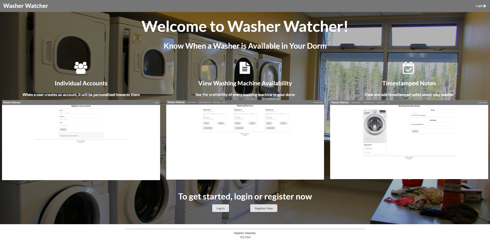

  
  
  

Washer Watcher is a web-application my group and I developed for our final project in our Software Engineering class, ICS 314. This is the first group project I have ever worked in in regards to programming projects, as well as my first "real" web-application I have worked on, so it was a very exciting and educational project for me. The final project was about solving problems in our university with a web-application. Washer Watcher aims to solve the issue for people living in shared spaces, where they bring their laundry down to the laundry room, only to find that all of the washing machines have been occupied. It attacks this issue by showing users which machines are in use before they make their trip down there, preventing any time wasted waiting for a washing machine to be done. 

Our group used Meteor, React with Semantic UI, and JavaScript to implement our solution. Washer Watcher was made with the University of Hawaii Manoa dorms in mind, so when a user registers, they have to pick whichever dorm they reside in. After they do that, the "Check Availability" page will show all the washing machines tied to that dorm and their availability status. Each washing machine card has a name, the last update message as well as when it was posted, and the current availability of the washing machine, which could be "Available", "In Use", or "Out of Order".

Being my first group project, I learned a lot about working in a group. We tackled to project using an Issue Driven Project Management approach, and I feel it really made working on the project issue-less and fluid. As long as we had a milestone set up with clear goals in mind, there was always something to do to further progress. It was always clear as to what should be done, and there were very few, if there were any, conflicts in getting work done. My group was just pleasant to work with. 

For more information on the project, it has a project page that you can check out at the [Github Project Page](https://washerwatcher.github.io/).

